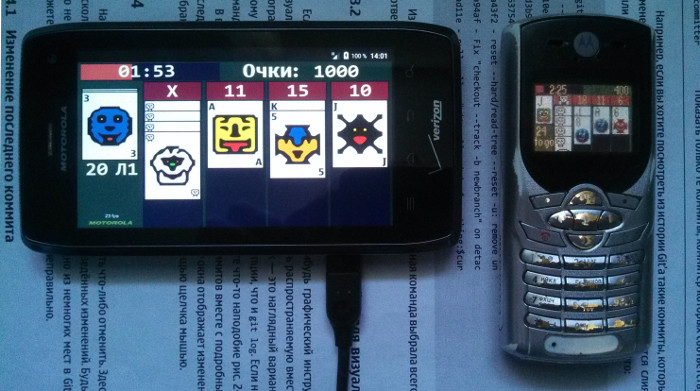
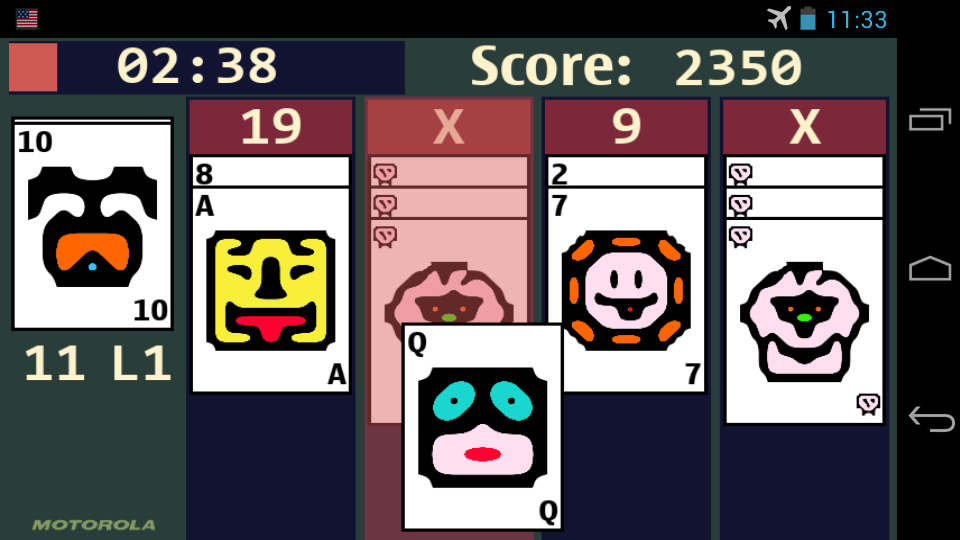

Snooder 21
=============

Snooder 21 is remake of very popular Motorola's standard card game: Snood™ 21 for Android OS.

<a href="https://f-droid.org/packages/ru.exlmoto.snood21/" target="_blank">
</a>
<a href="https://play.google.com/store/apps/details?id=ru.exlmoto.snood21" target="_blank">
</a>



Snooder 21 uses SurfaceView Canvas for drawing videocontext of the game. I added touch controls and some game engine improvements: launcher, drag and drop cards, sounds, etc.



## Download

You can download APK-package for Android OS from the [releases](https://github.com/EXL/Snooder21/releases) section.

## Build instructions

For example, GNU/Linux:

* Install the latest [Android SDK](https://developer.android.com/sdk/);

* Clone repository into deploy directory;

```sh
cd ~/Deploy/
git clone https://github.com/EXL/Snooder21 Snooder21Android
```

* Build the APK-package into deploy directory with Gradle building script;

```sh
cd ~/Deploy/Snooder21Android/
ANDROID_HOME="/opt/android-sdk/" ./gradlew assembleDebug
```

* Install Snooder 21 APK-package on your Android device via adb;

```sh
cd ~/Deploy/Snooder21Android/
/opt/android-sdk/platform-tools/adb install -r snooder21/build/outputs/apk/snooder21-debug.apk
```

* Run and enjoy!

You can also open this project in Android Studio IDE and build the APK-package by using this program.

## More information

Please read [Making Guide (In Russian)](http://exlmoto.ru/snooder21-droid) for more info about making Snooder 21 for Android OS.
